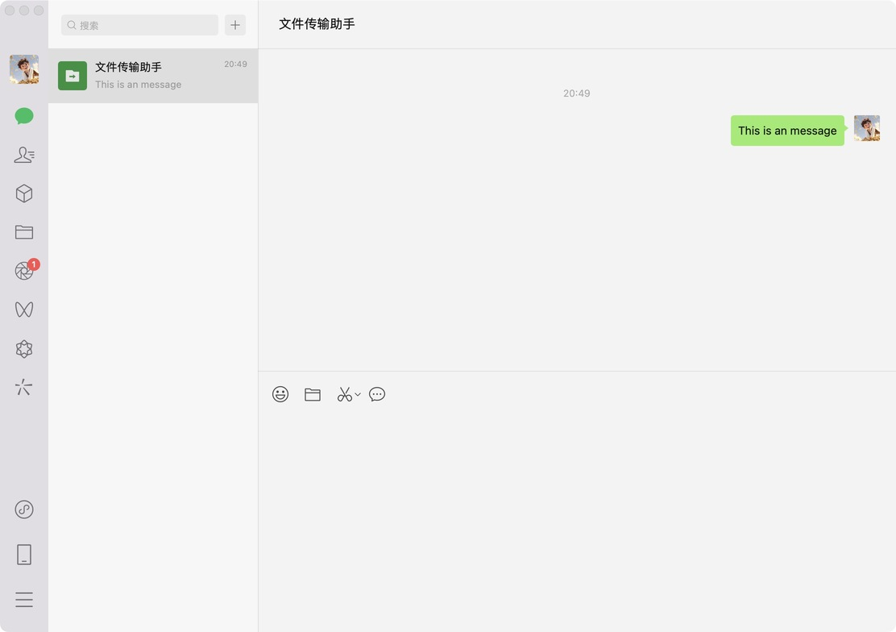

# Task2: Static Website 微信网页端静态网站开发

----
日期: 2025.07.12

描述: 本次作业要求学生基于提供的微信界面原型图，使用纯 HTML 和 CSS 技术开发一个微信网页端的静态网站。通过这个作业，考察学生最基础的 HTML + CSS 技术。

知识点：HTML + CSS 实现静态页面
 - 知识点1: HTML 基础知识
 - 知识点2: CSS 基础知识
 - 知识点3: Flex 布局
 - 知识点4: 定位方式
 - 知识点5: Icon 下载网站
----

## 参考原型



图片尺寸：1112px * 784px

## 工具

- VSCode
- Chrome 浏览器
- [Photopea](https://www.photopea.com/)，用来吸取颜色
- [Icon](https://www.iconfont.cn/)，用来下载图标

## 项目结构

```
task2/
├── index.html          # 主页面
├── css/
│   ├── style.css       # 主样式文件
├── assets/
│   ├── icons/          # 图标文件
└── README.md           # 项目说明
```

## 核心功能模块

### 1. 左侧导航栏
- 聊天列表
- 联系人
- 收藏
- 设置等功能入口

### 2. 聊天列表区域
- 显示聊天对话列表
- 支持搜索功能
- 显示最新消息预览
- 未读消息数量提示

### 3. 聊天内容区域
- 消息显示区域
- 消息输入框
- 工具栏（表情、文件等）
- 消息发送功能

### 4. 右侧信息面板
- 联系人信息
- 聊天记录